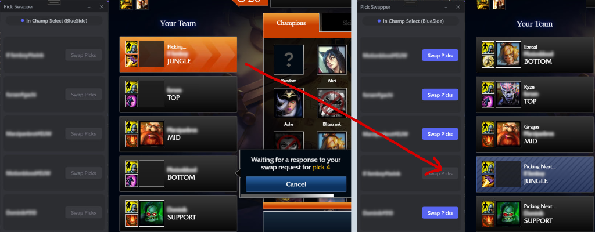

# League Classic Pick Swapper

A Windows desktop application for sending pick-order swap requests in League Classic champion select using the League Client Update (LCU) API.

---

## Preview

  

---

## Overview

In League Classic champion select, the native client includes UI elements to accept pick-order swaps, but does not provide an interface option to initiate or send them.

League Classic Pick Swapper connects to the local League client process and provides an interface to send pick-order swap requests directly to teammates.

### Key Functionality

- **Initiate Pick Swaps**: Sends pick-order swap requests to specific team members during draft.
- **Automatic Client Connection**: Detects and hooks into the running League client without manual configuration.
- **Anonymous Player Identification**: Displays assigned role positions (*Top, Jungle, Mid, Bot, Support*) when player names are hidden in League Classic.
- **Real-Time Session State**: Tracks lobby state, team side (Blue/Red), and swap availability in real-time.

---

## Technical Details

- **Framework**: C# / .NET 8.0 WPF
- **Client Integration**: League Client Update (LCU) REST API via [mayLCU](https://github.com/mayiflex/mayLCU)
- **JSON Library**: Newtonsoft.Json

### Architecture

1. **Client Connection**: Connects to the local LCU instance via `LCU.HookLeagueClient()` from [mayLCU](https://github.com/mayiflex/mayLCU) using lockfile credentials.
2. **Session Parsing**: Queries `/lol-champ-select/v1/session` to track lobby state, cell IDs, and assigned positions.
3. **Request Dispatching**: Maps target cell IDs based on team side (Blue: 0–4, Red: 5–9) and sends HTTP POST requests to `/lol-champ-select/v1/session/pick-order-swaps/{id}/request`.

---

## Usage

1. Launch **League Classic Pick Swapper**.
2. Enter Champion Select in League Classic.
3. Click **Swap Picks** next to the intended player or role position.

---

## Disclaimer

League Classic Pick Swapper is a third-party application using the local LCU API. It does not modify game memory or client files and is not affiliated with or endorsed by Riot Games.